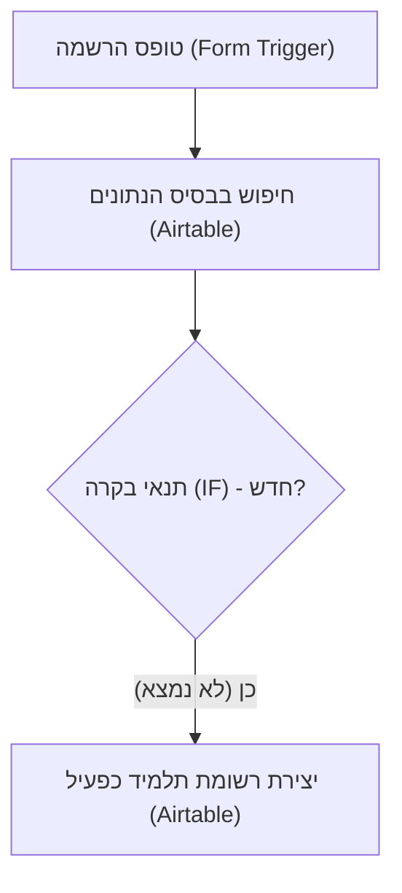
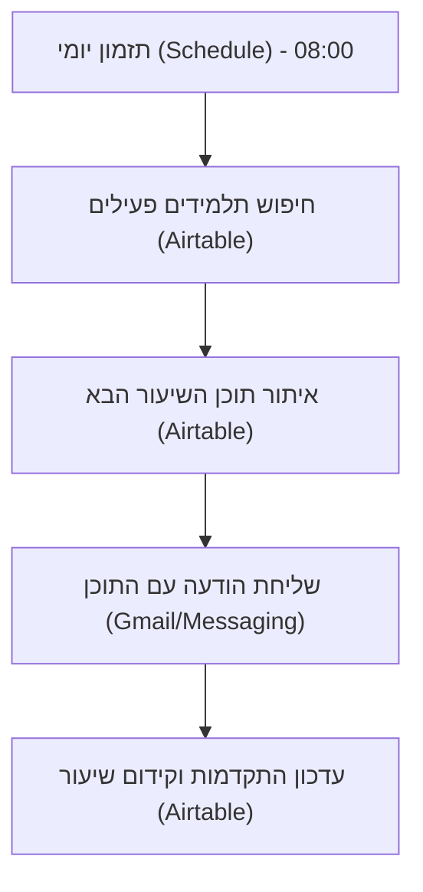
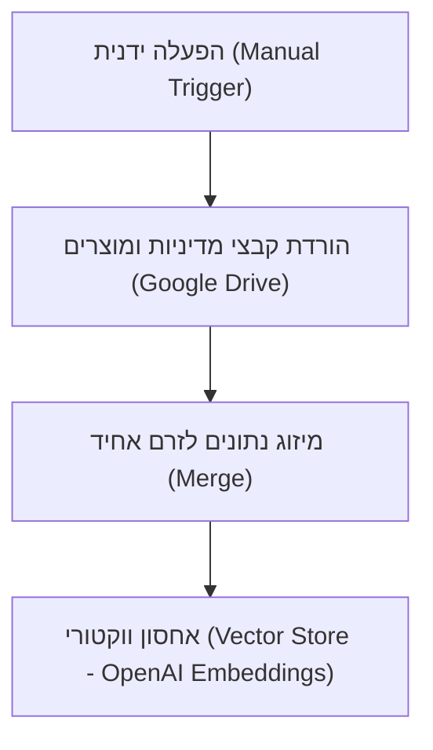
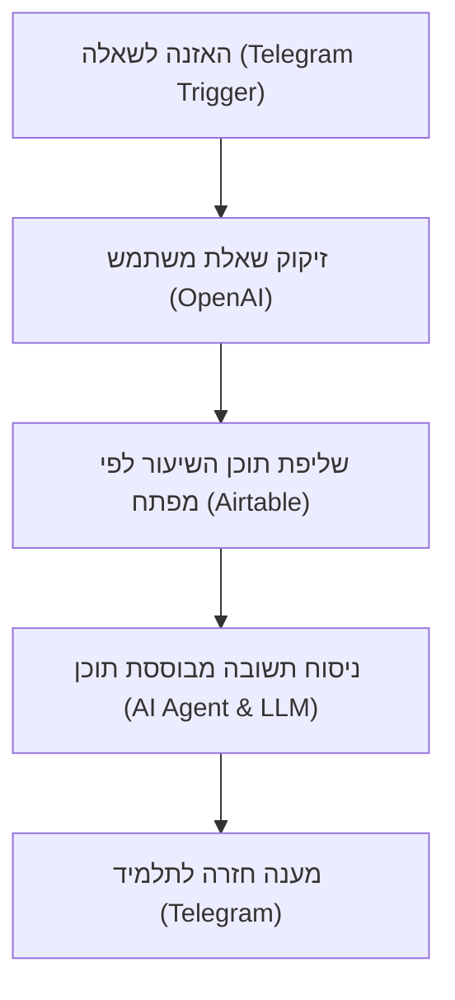
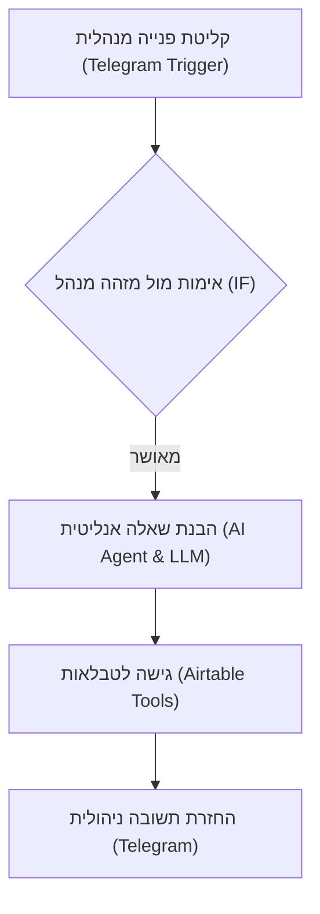

# The Inside Space - ERP System Final Project

## Project Overview
An AI-powered ERP system built for a small Israeli business, utilizing n8n Cloud for automated workflows, Airtable as the central database, and OpenAI for autonomous agents and RAG capabilities.

## System Architecture & Workflows

### 1. Onboarding Workflow (`The Inside Space - Onboarding`)
תהליך קליטה אוטומטי ומבוקר למשתמשים חדשים בקורס. האוטומציה נקלטת מטופס הרשמה, מבצעת בדיקת כפילויות מול בסיס הנתונים ב-Airtable, ובהיעדר רשומה קודמת – יוצרת כרטיס תלמיד חדש עם סטטוס "פעיל".

### 2. Daily Lessons Workflow (`The Inside Space - Daily Lessons`)
תהליך יומי אוטומטי שרץ בכל בוקר, שולף את רשימת התלמידים הפעילים, מאתר את השיעור הבא עבור כל תלמיד מתוך בסיס הנתונים, שולח את התוכן ישירות למייל/לוואטסאפ של התלמיד, ומעדכן אוטומטית את התקדמות מספר השיעור בכרטיס התלמיד.

### 3. RAG Pipeline (`RAG - Document Ingestion & Vectorization`)
צינור לעיבוד ווקטורי של מסמכי הליבה של העסק. האוטומציה מורידה את מסמכי המדיניות והמוצרים מ-Google Drive, ממזגת ומטעינה אותם לזיכרון ווקטורי (Vector Store) תוך שימוש במודל Embeddings של OpenAI, כבסיס ידע חכם לסוכני ה-AI.

### 4. Moving Space AI Bot (`Moving Space AI Bot`)
בוט אינטראקטיבי מבוסס AI המאזין להודעות נכנסות בטלגרם, ממקד ומזקק את שאלת המשתמש למילת מפתח, שולף את תוכן השיעור הרלוונטי מ-Airtable, ומנסח באמצעות מודל שפה תשובה אדיבה, מקצועית ומדויקת התחומה אך ורק לתכני הקורס.

### 5. Manager Agent (`Manager Agent`)
סוכן ניהולי חכם המוקדש לבעל העסק בטלגרם. הבוט מאמת את זהות השולח באמצעות תנאי בקרה קשיח, ומאפשר לנהל שאילתות אנליטיות וניהוליות על נתוני השיעורים והתלמידים ב-Airtable בזמן אמת.

## Repository Contents
- **Workflows (`.json`):** All n8n automation workflows including the Manager Agent, Onboarding, Daily Lessons, and RAG pipeline.
- **Execution Proof:** Includes `telegram-proof.png` demonstrating end-to-end bot execution and data retrieval.

## System Documentation & Policies (Google Docs)
- **מסמך אפיון מערכת:** [צפה במסמך האפיון](https://docs.google.com/document/d/14TwD95pet6TS_6vGb0EDj6Prg_pHATixxOlBkwX0Mdc/edit?tab=t.0)
- **מסמך מוצרים:** [צפה במסמך המוצרים](https://docs.google.com/document/d/1ce9fIT3-eSbkxoFMfErKs5tSYAcMijsEg9rV1O23-s8/edit?usp=sharing)
- **מסמך מדיניות:** [צפה במסמך המדיניות](https://docs.google.com/document/d/1csj_BbURIPKJOMEu0RHq4G-CDCH-EShO_LYjsbY1QVk/edit?tab=t.0)

## Access & Links
- **Airtable Base (Read-Only):** [https://airtable.com/invite/l?inviteId=inv6xvBU50F0WBHsu&inviteToken=c81033da90be9269221055bce98fa11e89f704e95ed9d86069a9001b9161412&utm_medium=email&utm_source=product_team&utm_content=transactional-alerts](https://airtable.com/invite/l?inviteId=inv6xvBU50F0WBHsu&inviteToken=c81033da90be9269221055bce98fa11e89f704e95ed9d86069a9001b9161412&utm_medium=email&utm_source=product_team&utm_content=transactional-alerts)
- **Telegram Integration:** Connected via Telegram Bot API for the Manager Agent.

## Execution Proof (Telegram)

