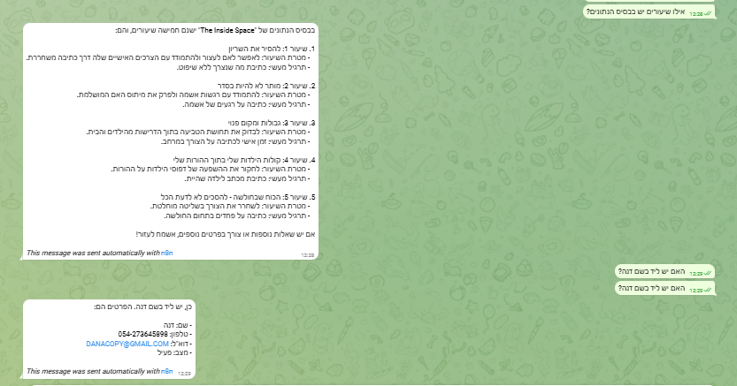

# The Inside Space - ERP System Final Project

## Project Overview
An AI-powered ERP system built for a small Israeli business, utilizing n8n Cloud for automated workflows, Airtable as the central database, and OpenAI for autonomous agents and RAG capabilities.

## Repository Contents
- **Workflows (`.json`):** All n8n automation workflows including the Manager Agent, Onboarding, Daily Lessons, and RAG pipeline.

## Access & Links
- **Airtable Base (Read-Only):** https://airtable.com/invite/l?inviteId=inv6xvBU50F0WBHsu&inviteToken=c81033da90be9269221055bce98fa11e89f704e95ed9d86069a9001b9161412&utm_medium=email&utm_source=product_team&utm_content=transactional-alerts
- **Telegram Integration:** Connected via Telegram Bot API for the Manager Agent.
- ## Execution Proof (Telegram)

## System Documentation & Policies (Google Docs)
- **מסמך אפיון מערכת:** [צפה במסמך האפיון](https://docs.google.com/document/d/14TwD95pet6TS_6vGb0EDj6Prg_pHATixxOlBkwX0Mdc/edit?tab=t.0)
- **מסמך מוצרים:** [צפה במסמך המוצרים](https://docs.google.com/document/d/1ce9fIT3-eSbkxoFMfErKs5tSYAcMijsEg9rV1O23-s8/edit?usp=sharing)
- **מסמך מדיניות:** [צפה במסמך המדיניות](https://docs.google.com/document/d/1csj_BbURIPKJOMEu0RHq4G-CDCH-EShO_LYjsbY1QVk/edit?tab=t.0)
